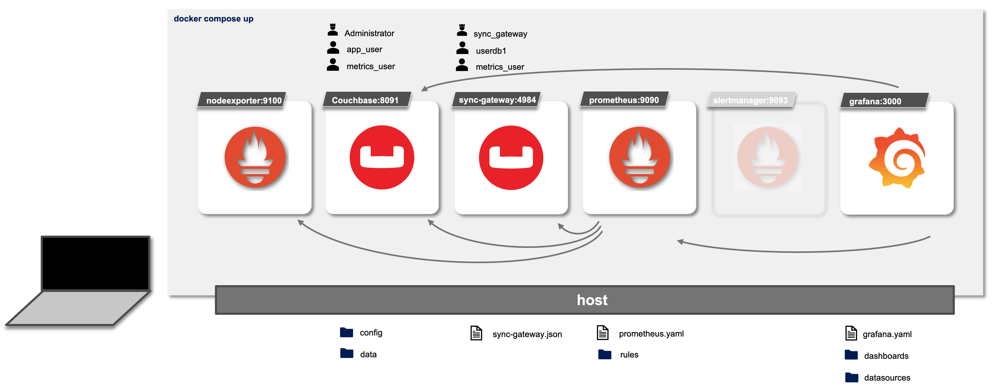

# Quickstart for Sync Gateway Developer Kit (Docker Compose Quickstart)
 A quick starting kit for developers deploying via Docker Compose the Sync Gateway +3.1.3 & Couchbase +7.2.3 cluster environment using Scope &amp; Collections



# Pre-requisites

* Docker Compose 

# Getting Starting (First Time you run it)

0. Build SGW docker image

```
docker compose build --no-cache
```


1. Deploy Docker Compose Couchbase Server & Sync Gateway Instances

```
docker-compose up
```


2. Wait Until Buckets & Sync Gateway are ready 


Wait until your Sync Gateway is available in the following link http://localhost:4984 


Verify the Couchbase Server Admin Console with username: `Administrator` and password `password` on http://localhost:8091


Check the Couchbase Server `demo` bucket and `custom` scope with the three collections: `typeA`, `typeB` & `typeC`.


Check the Couchbase Server User `sync_gateway` with mobile sync gateway role on demo bucket and `metrics_user` for prometheus metrics scrapping in Sync Gateway and Couchbase Server. 


Note: This Sync Gateway configuration does not include TLS connections. 


**Verify Sync Gateway Database & Users**

From your host CMD/terminal you can check the `db` database and `userdb1` user creation: 

```
curl http://localhost:4985/db/
```

Note: This database configuration has defined `num_index_replicas: 0`. Please change this parameter to the default value 1 when your Couchbase Server cluster contains at least 2 indexes service nodes. 

In this example, we have setup a `custom` scope and collections `typeA` and `typeB`. Note: collection `typeC` is not synced with this Sync Gateway database. 

```
curl http://localhost:4985/db/_config
```

Let´s verify the database users 

```
curl http://localhost:4985/db/_user/
```

And the user `userdb1` details info:

```
curl http://localhost:4985/db/_user/userdb1
```

**Verify your Monitoring System**


* Node Exporter at [http://localhost:9100](http://localhost:9100)


* Prometheus at [http://localhost:9090](http://localhost:9090)


* Grafana at [http://localhost:3000](http://localhost:3000)


Let´s load the sync gateway dashboard...


3. Run your own Couchbase Mobile App

```
replication sgw url: ws://127.0.0.1:4984/db
replication scope: custom
replication collections: typeA,typeB
authenticator: 
	username: userdb1
    password: Password1! 
```

Or you can use this simple java client main example code:

Dependencies on **pom.xml**
```
    <repositories>
        <repository>
            <id>couchbase-lite-repo</id>
            <name>couchbase-repo</name>
            <url>https://mobile.maven.couchbase.com/maven2/dev/</url>
        </repository>
    </repositories>
    
    <dependencies>
        <dependency>
            <groupId>com.couchbase.lite</groupId>
            <artifactId>couchbase-lite-java-ee</artifactId>
            <version>3.2.2</version>
        </dependency>
    </dependencies>
 
```

**MainClass.java**

```java
    public static void main(String[] args) throws CouchbaseLiteException, URISyntaxException, InterruptedException, IOException {
        System.out.println("Starting CouchbaseLite at " + LocalTime.now());
        com.couchbase.lite.CouchbaseLite.init();
        Thread.sleep(2000);
        String username = System.getProperty("user.name") != null ? System.getProperty("user.name") : "userdb1";
        String password = System.getProperty("user.password") != null ? System.getProperty("user.password") : "Password1!";
        String sgwURI = System.getProperty("sgw.uri") != null ? System.getProperty("sgw.uri") : "ws://localhost:4984/db";
        
        DatabaseConfiguration config = new DatabaseConfiguration();
        config.setFullSync(false);
        config.setDirectory("data/"+username);
        Database database = new Database("db", config);

        Collection colA = database.createCollection("typeA", "custom");
        Collection colB = database.createCollection("typeB", "custom");
        

        URI syncGatewayUri = new URI(sgwURI);
        ReplicatorConfiguration replConfig = new ReplicatorConfiguration(new URLEndpoint(syncGatewayUri));  // working with custom scope and collections

        replConfig.setType(PUSH_AND_PULL);
        replConfig.setAutoPurgeEnabled(true);
        replConfig.setAuthenticator(new BasicAuthenticator(username, password.toCharArray()));
        replConfig.setContinuous(true);
        CollectionConfiguration collectionConfiguration = new CollectionConfiguration();
        collectionConfiguration.setConflictResolver(ConflictResolver.DEFAULT);
        replConfig.addCollections(List.of(colA, colB), collectionConfiguration);

        Replicator replicator = new Replicator(replConfig);
        replicator.addChangeListener(change -> {

            if (change.getStatus().getError() != null) {
                System.err.println("Error in replication ("+change.getStatus().getActivityLevel()+"): " + change.getStatus().getError().getMessage());
            } else {
                System.out.println("Replication in progress: " + change.getStatus().getActivityLevel());
            }

            if(change.getStatus().getActivityLevel().equals(ReplicatorActivityLevel.IDLE) || change.getStatus().getActivityLevel().equals(ReplicatorActivityLevel.STOPPED)){
                System.out.println("Documents in the local database: " + colA.getCount());

                if (change.getStatus().getActivityLevel().equals(ReplicatorActivityLevel.STOPPED)) {
                    System.out.println("Exiting..."); 
                    System.exit(0);
                }
            }
        });

        replicator.start();
    }
```

Note: userdb1 only has permissions on "blue" channel for collections `typeA` and `typeB`. To sync documents you would need to create documents with `channels: ["blue"]` on these collections or change the admin channels permissions in the `sgw/config/users.json` file 


# Start / Stop Docker Compose


1. Start docker compose

```
docker-compose up
```

2. Stop docker compose

`ctrl-c` & then 

```
docker-compose down
```

3. Clean up logs & data from Couchbase Server mapped into localhost volume

```
./cleanup-data.sh
```


# References

* [https://developer.couchbase.com/sync-gateway-setup](https://developer.couchbase.com/sync-gateway-setup)
* [https://github.com/brantburnett/couchbasefakeit](https://github.com/brantburnett/couchbasefakeit)

