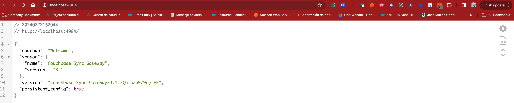

# Quickstart for Sync Gateway Developer Kit (Docker Compose Quickstart)
 A quick starting kit for developers deploying via Docker Compose the Sync Gateway +3.1.3 & Couchbase +7.2.3 cluster environment using Scope &amp; Collections

# Pre-requisites

* Docker Compose 

# Getting Starting (First Time you run it)

0. Build SGW docker image

```
docker compose build
```


1. Setup Docker Compose Couchbase Server & Sync Gateway Instances

```
docker-compose up
```


2. Wait Until Buckets & Sync Gateway are ready 


Wait until your Sync Gateway is available in the following link http://localhost:4984 





Verify the Couchbase Server Admin Console with username: `Administrator` and password `password` on http://localhost:8091


Check the Couchbase Server `demo` bucket and `custom` scope with the three collections: `typeA`, `typeB` & `typeC`.


Check the Couchbase Server User `sync_gateway` with mobile sync gateway role on demo bucket. 


Note: This Sync Gateway configuration does not include TLS connections. 


3. Verify Sync Gateway Database & Users

From your host CMD/terminal you can check the `db` database and `userdb1` user creation: 

```
curl -X GET "http://localhost:4985/db/" -H "accept: */*" -H "Content-Type: application/json" 
```

In this example, we have setup a `custom` scope and collections `typeA` and `typeB`. Note: collection `typeC` is not synced with this Sync Gateway database. 

Note: This database configuration has defined `num_index_replicas: 0`. Please change this parameter to the default value 1 when your Couchbase Server cluster contains at least 2 indexes service nodes. 

```
curl -u sync_gateway:password -X GET "http://localhost:4985/db/_user/" -H "accept: */*" -H "Content-Type: application/json"
```

4. Run your own Couchbase Mobile App

```
replication sgw url: ws://127.0.0.1:4984/db
replication scope: custom
replication collections: typeA,typeB
authenticator: 
	username: userdb1
    password: password 
```


# Start / Stop Docker Compose


1. Start docker compose

```
docker-compose up
```

2. Stop docker compose

`ctrl-c` & then 

```
docker-compose down
```

3. Clean up logs & data from Couchbase Server mapped into localhost volume

```
./cleanup-data.sh
```


# References

* [https://developer.couchbase.com/sync-gateway-setup](https://developer.couchbase.com/sync-gateway-setup)
